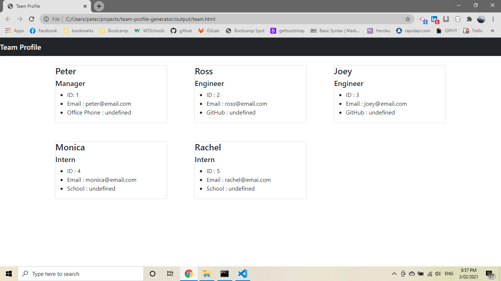

# team-profile-generator

link to repository : https://github.com/pfotis/team-profile-generator

link of the video-demostration : https://drive.google.com/file/d/1_O6c42A0ANnuiAiXJbQZOadJ8NoH33qs/view

## Description

this project help the user to create a html file for his/her team's profile. The application work from the git Bash and the user could test the code by typing "npm run test" and run the code by typing "node index.js". To do this the user need to be the same folder with the index.js file.

## The following photo is the result from the application .

